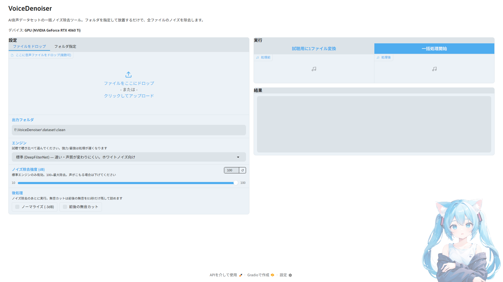

# VoiceDenoiser

[日本語](README.md)


Batch noise removal tool for AI voice datasets.

Point it at your TTS / RVC / SoVITS training dataset and an AI model automatically removes white noise and background noise from every file — just set the folders and walk away.



## Features

- **Batch processing** — recursively scans the input folder, preserving folder structure and file names in the output
- **AI-based denoising** — unlike conventional noise gates, an AI model trained on voice removes everything that isn't voice
- **Three engines** — Standard (DeepFilterNet: fast and safe) / Strong (Resemble Enhance: handles lip noise and other transients) / Max (with restoration). Compare them by ear with the preview feature
- **Doesn't break your training data** — output keeps the original sample rate; denoising strength is adjustable
- **Preview** — convert a single file and compare before/after prior to the full run
- **Post-processing** — optional normalization (-3 dB) and leading/trailing silence trimming
- **Resume support** — already-processed files are skipped, so interrupted runs pick up where they left off
- **GUI** — built with Gradio, runs in your browser. Uses the GPU automatically if available (CPU also works)

## Requirements

- Python 3.10+
- Windows / Linux
- NVIDIA GPU recommended (works without one, but the Strong/Max engines are much slower on CPU)

## Setup

```bash
git clone https://github.com/ReineHonoka/VoiceDenoiser.git
cd VoiceDenoiser
setup.bat        # Windows
# ./setup.sh     # Linux
```

This creates the venv, installs PyTorch (auto-detects your GPU and picks the CUDA or CPU build), installs dependencies, and downloads the AI models (about 700 MB).

## Usage

```bash
run.bat          # Windows
# ./run.sh       # Linux
```

Your browser opens `http://127.0.0.1:7860`.

1. Put audio files in `dataset/raw/` (or drop them directly onto the GUI, or point it at any other folder)
2. Use the preview to compare before/after and pick an engine and strength
3. Hit "Start batch" and walk away → output goes to `dataset/clean/`

### Choosing an engine

| Engine | Speed | Best for | Notes |
|---|---|---|---|
| Standard (DeepFilterNet) | Fast | White noise, background noise | Least likely to alter the voice. Start here |
| Strong (Resemble Enhance) | Slow | Lip noise and other transients | When Standard doesn't cut it |
| Max (Resemble Enhance + restoration) | Slow | The above + audio restoration | May alter voice quality — always preview first |

## Supported formats

wav / flac / mp3 / ogg (lossy mp3/ogg inputs are written out as wav)

## License

[MIT License](LICENSE)

## Credits

- Denoising model: [DeepFilterNet](https://github.com/Rikorose/DeepFilterNet) (MIT / Apache-2.0)
- Denoising model: [Resemble Enhance](https://github.com/resemble-ai/resemble-enhance) (MIT) — inference code only, bundled in `resemble_enhance/` (deepspeed dependency removed for Windows support)
- UI theme: [NoCrypt/miku](https://huggingface.co/spaces/NoCrypt/miku) (Apache-2.0)
